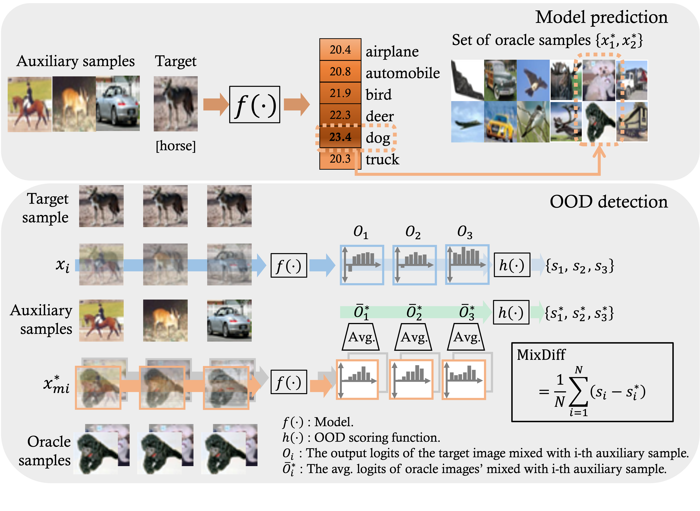

# Perturb-and-compare Approach for Detecting Out-of-distribution Samples in Constrained Access Environments

This repossitory contains the implementation of MixDiff framework.

<!--  -->

# Setup

```bash
conda env create -f environment.yml
conda activate mixdiff
```

# Setup

## Checkpoints

Place `CLIP-ViT-B32` checkpoint under the directory `trained_models/ViT-B32` after downloading the checkpoint using the [official CLIP repository](https://github.com/openai/CLIP).

## Datasets

Place the datasets as below:

* `Caltech101`
    * Unzip the dataset under the directory `data/caltech101`.

* `CIFAR10`
    * The dataset is automatically downloaded when the code is run.

* `CIFAR100`
    * The dataset is automatically downloaded when the code is run.

* `CIFAR10+`
    * The dataset is automatically downloaded when the code is run.

* `CIFAR50+`
    * The dataset is automatically downloaded when the code is run.

* `TinyImageNet`
    * Run the following script: `tinyimagenet.sh`.

# Run Experiments Where Model Outputs Are Predction Probabilties

## Search hyperparameters on Caltech101 

```bash
bash mixup/scripts/in_batch/run_caltech_in_bat.sh

```

## Evaluate on Benchmark Datasets

Run the script below after replacing `OOD_METHOD` with one of the following names: `entropy`, `msp`.

```bash
bash mixup/scripts/in_batch/run_{OOD_METHOD}_s_in_bat.sh
```

# Run Experiments Where Model Outputs Are Prediction Labels

## Search hyperparameters on Caltech101 

To search hyperparameters in the setup where oracle samples are used as auxiliary samples run the script below:

```bash
bash mixup/scripts/one_hot/run_caltech_agmax_orc.sh
```

To search hyperparameters in the setup where random ID samples are used as auxiliary samples run the script below:

```bash
bash mixup/scripts/one_hot/run_onehot_agmax_rnd_id.sh
```

## Evaluate on Benchmark Datasets

To evaluate in the setup where oracle samples are used as auxiliary samples run the script below:

```bash
bash mixup/scripts/one_hot/run_caltech_agmax_orc.sh
```

To evaluate in the setup where random ID samples are used as auxiliary samples run the script below:

```bash
bash mixup/scripts/one_hot/run_caltech_agmax_rnd_id.sh
```


# Acknowledgments

We built our experiment pipeline from the codebase of [ZOC repository](https://github.com/sesmae/zoc). We thank the authors of ["Zero-Shot Out-of-Distribution Detection Based on the Pre-trained Model CLIP"](https://arxiv.org/pdf/2109.02748.pdf) for sharing thier code.