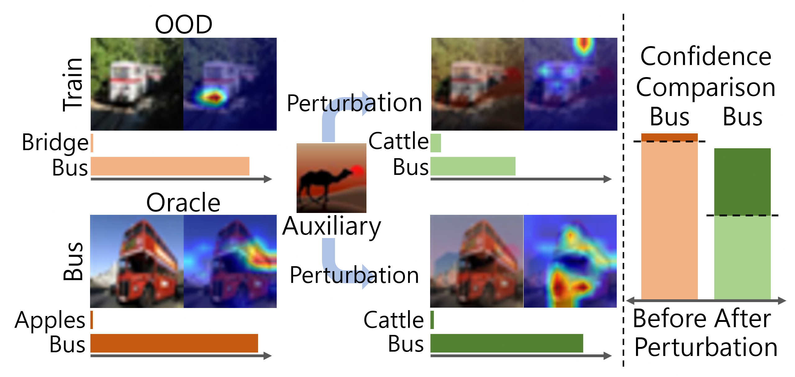

# Perturb-and-compare Approach for Detecting Out-of-distribution Samples in Constrained Access Environments

This repossitory contains code for the paper *Perturb-and-compare Approach for Detecting Out-of-distribution Samples in Constrained Access Environments* (ECAI 2024).

## Abstract
<!--  -->
<p align="center">

</p>


*Accessing machine learning models through remote APIs has been gaining prevalence following the recent trend of scaling up model parameters for increased performance. Even though these models exhibit remarkable ability, detecting out-of-distribution (OOD) samples remains a crucial safety concern for end users as these samples may induce unreliable outputs from the model. In this work, we propose an OOD detection framework, MixDiff, that is applicable even when the model's parameters or its activations are not accessible to the end user. To bypass the access restriction, MixDiff applies an identical input-level perturbation to a given target sample and a similar in-distribution (ID) sample, then compares the relative difference in the model outputs of these two samples. MixDiff is model-agnostic and compatible with existing output-based OOD detection methods. We provide theoretical analysis to illustrate MixDiff's effectiveness in discerning OOD samples that induce overconfident outputs from the model and empirically demonstrate that MixDiff consistently enhances the OOD detection performance on various datasets in vision and text domains.*


## Setup

### Install packages

```bash
conda env create -f environment.yml
conda activate mixdiff
```

### Prepare datasets

Place the datasets as below:

* `CIFAR10`
    * The dataset is automatically downloaded when the code is run.

* `CIFAR100`
    * The dataset is automatically downloaded when the code is run.

* `CIFAR10+`
    * The dataset is automatically downloaded when the code is run.

* `CIFAR50+`
    * The dataset is automatically downloaded when the code is run.

* `TinyImageNet`
    * Run `tinyimagenet.sh` script in `data` directory.


## Run baselines

Evaluate output-based baseline OOD scoring functions (MSP, MLS, etc.) on benchmark datasets.

```bash
bash mixup/scripts/baselines/baselines.sh
```

## Experiments where model outputs are logits

Evaluate MixDiff's peformance when the model outputs are logits.

```bash
bash mixup/scripts/logit/mixdiff_logit.sh
```

## Experiments where model outputs are predction probabilties

Run the script below after replacing `OOD_METHOD` with one of the following names: `entropy`, `msp`.

```bash
bash mixup/scripts/prob/mixdiff_prob_{OOD_METHOD}.sh
```

Evaluate the setup where oracle samples are used as auxiliary samples.

```bash
bash mixup/scripts/prob/mixdiff_entropy_orc.sh
```

Evaluate the setup where random ID samples are used as auxiliary samples.

```bash
bash mixup/scripts/prob/mixdiff_entropy_rnd_id.sh
```

## Experiments where model outputs are prediction labels

Evaluate using oracle samples as auxiliary samples.

```bash
bash mixup/scripts/label/onehot_agmax_orc.sh
```

Evaluate using random ID samples as auxiliary samples.

```bash
bash mixup/scripts/label/onehot_agmax_rnd_id.sh
```

## Experiments where model outputs are last layer activations

```bash
bash mixup/scripts/embed/mixdiff_embedding.sh
```

## Adversarial attack experiemnts

Evaluate baseline under various adversarial attack scenarios.

```bash
bash mixup/scripts/adv_attack/baselines.sh
```

Evaluate *MixDiff+Entropy* under various adversarial attack scenarios.

```bash
bash mixup/scripts/adv_attack/entropy_orc_mixdiff.sh
```

Evaluate *MixDiff only* under various adversarial attack scenarios.

```bash
bash mixup/scripts/adv_attack/entropy_orc_mixdiff_only.sh
```

Evaluate *MixDiff only* on clean samples.

```bash
bash mixup/scripts/adv_attack/entropy_orc_mixdiff_only_clean.sh
```


## Out-of-scope detection experiments

### Prepare datasets

* `ACID`
    * Download the dataset from [the official repository.](https://github.com/AmFamMLTeam/ACID)
    * Place `data/acid/customer_training.csv` and `data/acid/customer_testing.csv` under the directory `data/acid/`.

* `CLINIC150`
    * Download the dataset from [the official repository](https://github.com/clinc/oos-eval/tree/master/data).
    * Place `data_full.json` under the directory `data/clinc150`.

* `TOP`
    * Download the dataset from the [link](http://fb.me/semanticparsingdialog) provided in the paper.
    * Unzip the file under the directory `data/top`.

* `Banking77`
    * This dataset is automatically downloaded when the code is run.

### Train intent classification models

Run the script after replacing `DATASET_NAME` with one of the following names: `clinic150`, `banking77`, `acid`, `top`. This will train intent classification models for MixDiff hyperparameter search as well as the final OOS detection performance evaluation.

```bash
bash text_classification/scripts/train_{DATASET_NAME}.sh
```

### Hyperparameter search on validation splits

```bash
bash mixup_text/scripts/run_val.sh
```

### Evaluation on test splits

Run evaluation on the test split by selecting appropriate values in the script below.


```bash
bash mixup_text/scripts/run_test.sh
```

### Run baselines

Run MLS, MSP, Energy and entropy OOS detection baselines by using the script below.

```bash
bash mixup_text/scripts/run_baselines.sh
```

## Citation

```bibtex
TODO
```

## Acknowledgments

We built our experiment pipeline from the codebase of [ZOC repository](https://github.com/sesmae/zoc). We thank the authors of *["Zero-Shot Out-of-Distribution Detection Based on the Pre-trained Model CLIP"](https://arxiv.org/pdf/2109.02748.pdf)* for sharing thier code.